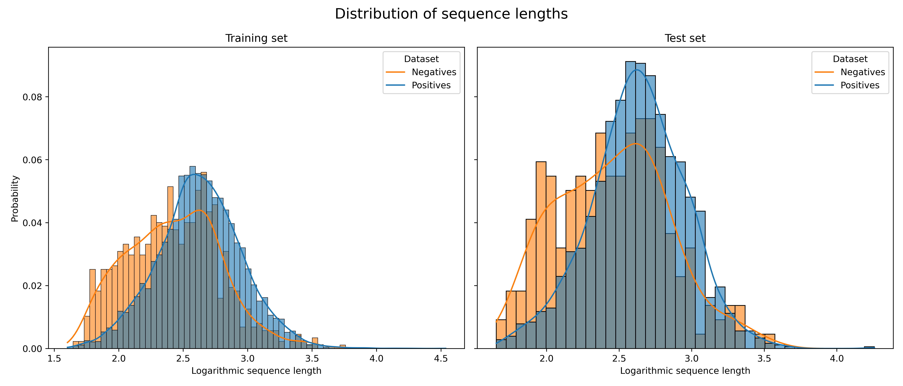
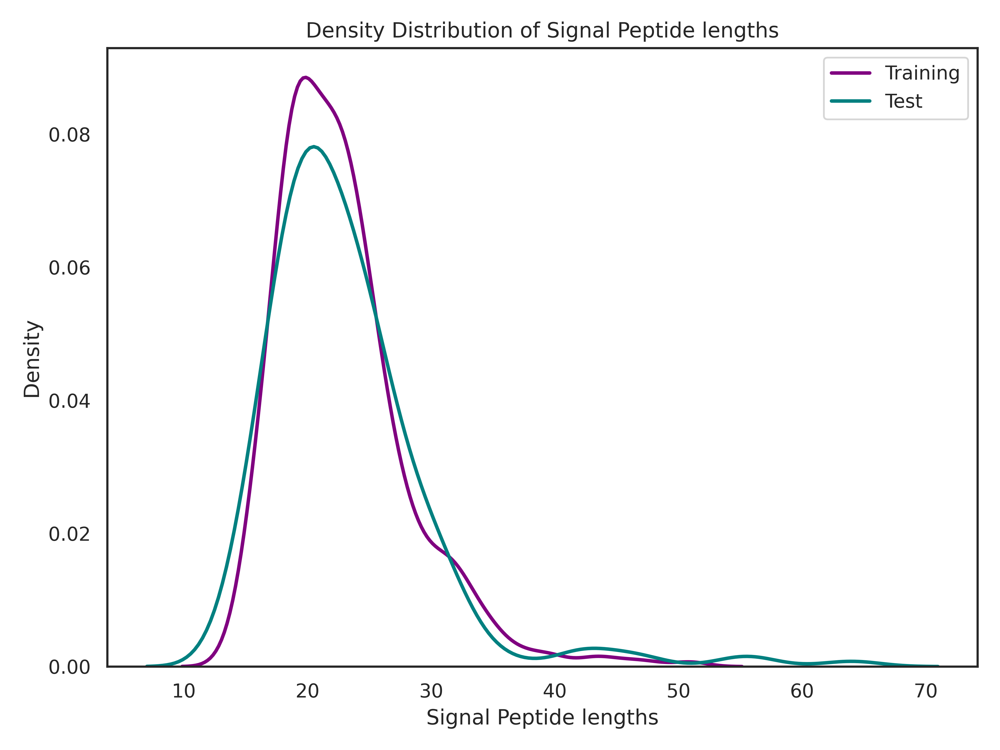
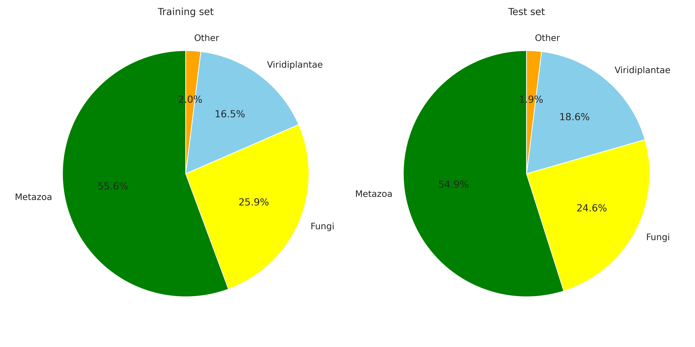
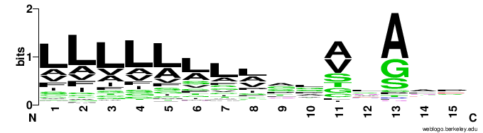
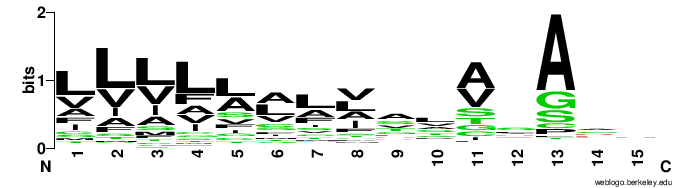

# Data analysis
In this step we explored data comparing training and test set 

## 1. Comparison between sequence length in positive and negative entries
The distribution of sequence lengths ( log10-transformed for easier visualization ) were compared between positive and negative entries from both Training and Test sets. 

* **Training Set**: Sequence with a **Signal Peptide** ( positives - 1 ) tend to be **shorter** than the sequences without Signal Peptide ( negative - 0 ). The distribution of positive sequences is visibly shifted to the left ( shorter ) compared to the negatives.
* **Test Set**: We can see a similar trend to the distributions from the training set, having a lower average length in the sequences containing a Signal Peptide

## 2. Distributions of signal peptides lengths 
The distribution of Signal Peptide **lengths** was compared between the positive ( containing SP ) entries from the training set and from the test set.

* The distributions are **unimodal** and heavily **centered** between  **15-30 amino acids** in length, as expected from a signal peptide.
* The distribution of Signal Peptide lengths from the training and the test sets are **highly similar**, suggesting the test set is a representative sample to be used in combination with the training set 

## 3. Comparison of the amminoacid composition of SPs between our datasets and SwissProt data
The amino acid composition of the Signal Peptides from our dataset was compared to the general amino acid composition of all proteins in the SwissProt database.

* **Dominant Amino Acid**: Signal Peptide amino acid composition in our dataset ( training + testing ) is characterized by a **significantly high frequency** of **Leucine (L)** ( ~ 22% ) and **Alanine**  ( ~ 14% ).
* **Comparison with SwissProt**: The composition of our SP seqeunces show a **drastically higher content** of **L,A,M,F,I and C** amino acids compare the the overall average of all proteins in SwissProt. This is to be expected as these residues are characteristic of the hydrophobic core of the SP. Likewise our SP sequences show a markedly lower concentration of highly hydrophilic residues. 

## 4. Taxonomic classification at kingdom and species level
The distribution of protein entries across different kingdoms was analyzed.

* **Kingdoms**: In both the training and test sets, **Metaazoa** is the overwhelmingly dominant kingdom, **representing ~55%** of the overall sample. The remainder of the entries are split between **Fungi**( ~25% ), **Viridiplantae** ( ~17% ), and _other_ ( ~2% )
* **Comparison Between Sets**: Overall the composition of the sets is nearly identical between training and test sets, reinforcing the idea that they are representative of eachother.

## 5. Sequence logos

The Signal Peptide **cleaved site** was analysed to generate the sequence logos for the training and test sets. We isolated the 15 aa region ( -13, +2 ) around the known cleaveg site. 

* **Hydrophobic Region**: The residues directly preciding the cleavege site are dominated by **hydrophobic** amino acids that are highly conserved in signal peptides, typically **Leucine ( L ), Valanine ( V ), Isoleucine ( I )**. These also account for the measurebly high levels of these amino acids in the composition analysis. 
* **Cleavege Motif**: 

 
<figure>
 
  <figcaption><em>Sequence logo of the train set.</em></figcaption>
</figure>

<figure>
 
  <figcaption><em>Sequence logo of the test set.</em></figcaption>
</figure>
